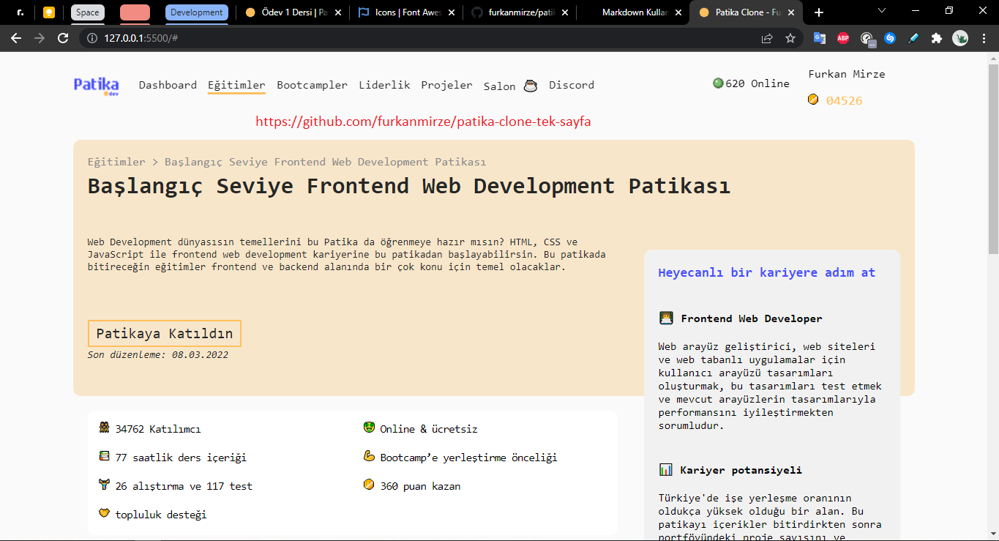
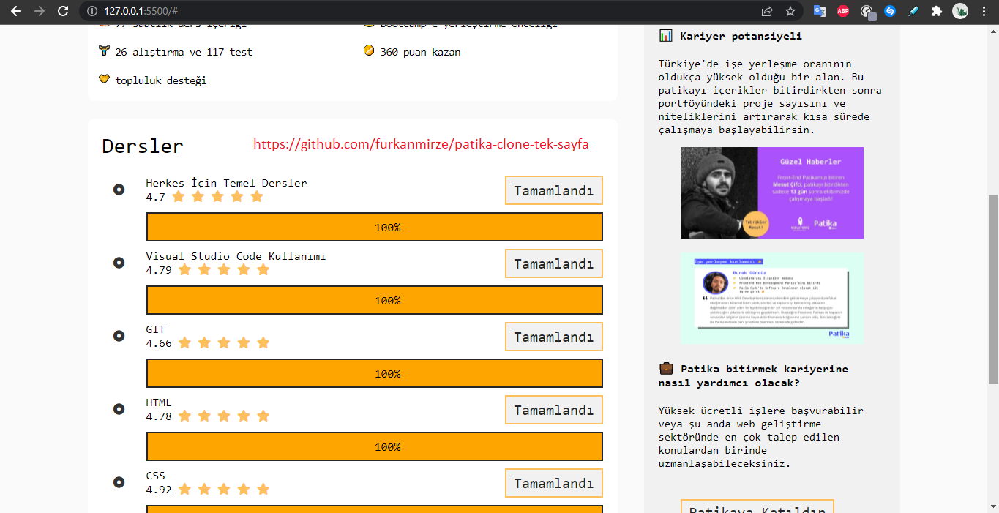

# PATIKA CLONE TEK SAYFA / ÖRNEK WEB SİTE

>### CSS mantığını öğrenmek ve pekiştirmek için patika.dev'in tek sayfalık klon uygulamasını yaptım. Detaylı olarak kodlarımı incelemek için lütfen GitHub profilimden projeyi inceleyin.

>### Sayfa klonu hakkında daha fazla bilgi edinmek için **CSS** dizini içindeki stil dosyalarını inceleyin.

>### Sayfa üzerindeki bazı küçük detaylar dışında aynı oranda yapıldı

### GÖRSELLERİNE AŞAĞIDAN BAKABİLİRSİNİZ

